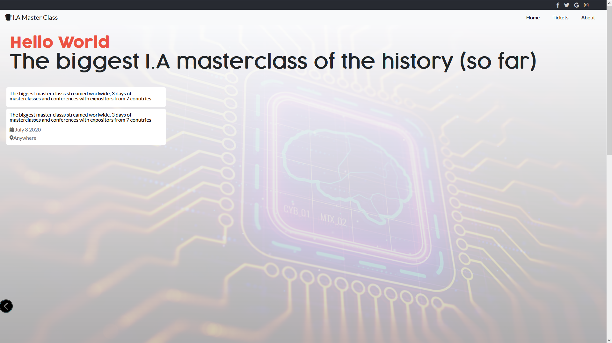

# I.A Event

Website created to advertise an event , conferences about the I.A
original design idea by [Cindy Shin in Behance](https://www.behance.net/adagio07)

## Built With

- HTML, CSS and Bootstrap

## Live Demo

[Live Demo Link](https://adfpizarro.github.io/IA-Event/)

## Getting Started

To get a local copy up and running follow these simple example steps.

git clone https://github.com/AdfPizarro/IA-Event
Open the index.html with your favorite browser
Explore our site

### Usage

- Just open the `index.html` file

## Commands
- `lintcss` Checks the css for any lint errors
- `lintcss:fix` Checks the css for any lint errors and tries to fix what it can

Note: You need to do `npm install` before executing the commands above.

## Authors

👤 **Adrian Flores Pizarro**

- Github: [@AdfPizarro](https://github.com/AdfPizarro)
- Twitter: [@AdfPizarro](https://twitter.com/adfpizarro)
- Linkedin: [adrian-flores-pizarro-73b62316a](https://www.linkedin.com/in/adrian-flores-pizarro-73b62316a/)

## 🤝 Contributing

Contributions, issues and feature requests are welcome!

Feel free to check the [issues page](issues/).

## Show your support

Give a ⭐️ if you like this project!

## Acknowledgments

- Hat tip to anyone whose code was used
- Inspiration
- etc

## 📝 License

This project is [MIT](lic.url) licen
